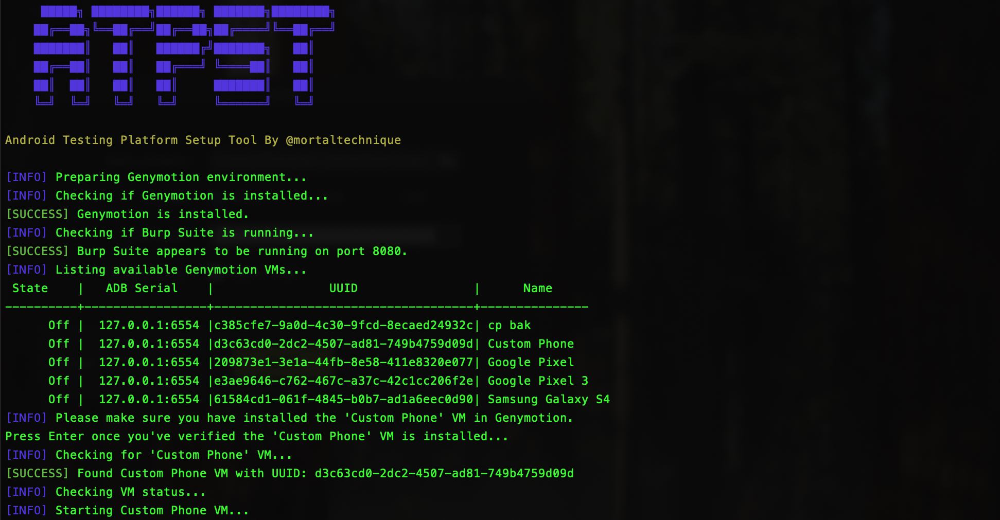
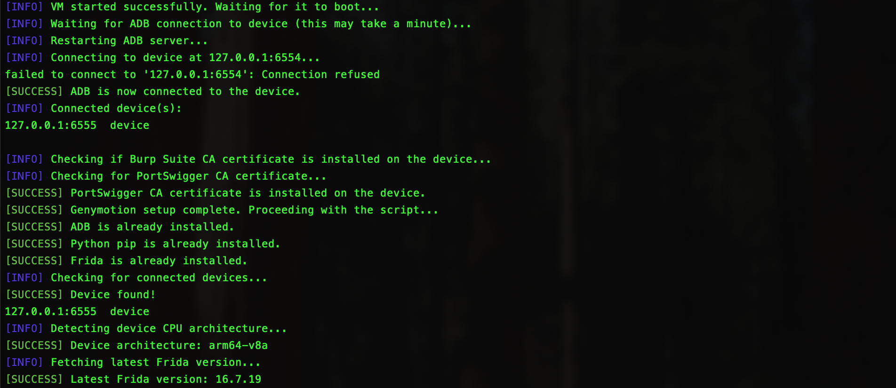
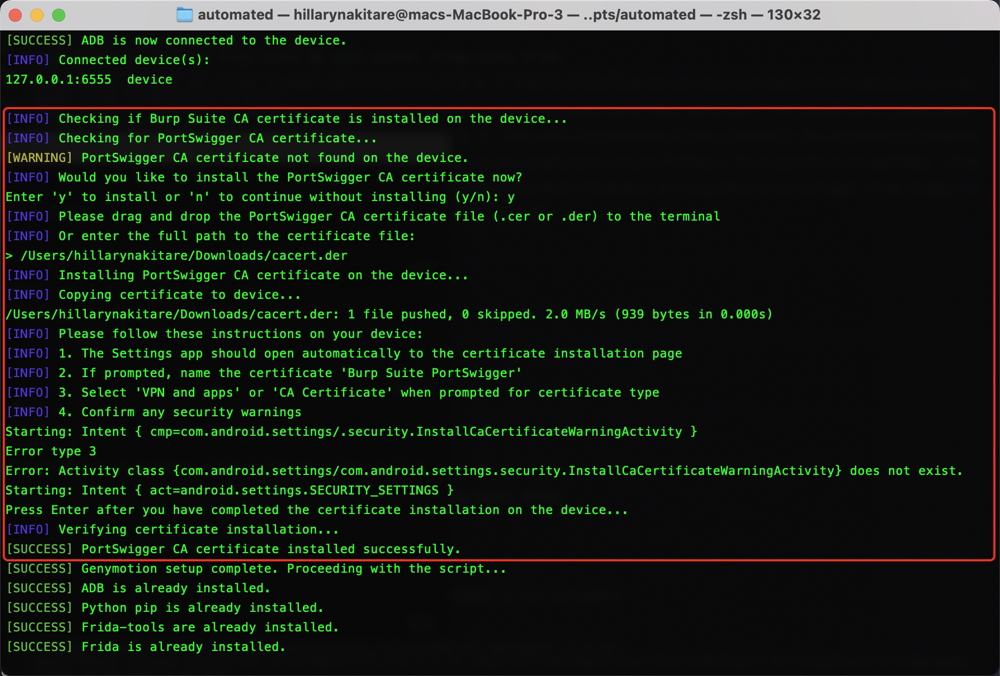
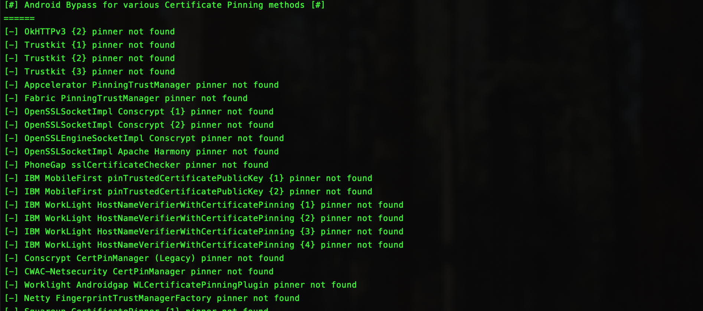

# ATPST

Android Testing Platform Setup Tool (ATPST) is a small script i wrote that semi-automated the prcoess of setting up Genymotion, frida, adb and bypassing Android Trustmanger when conducting security testing.

From my knowledge, Genymotion as of the day of this creation, requires a paid account to support `rooted` devices. Only `android 12`, fro the Custom Phone has this. Which brings us to some simple preliquisites before using the script:

## Preliquisites
- MacOS. I initially built this for my macOS environment meaning some brew installs here and there. This can be easily modified to suite Linux systems as well. Feel free to edit.
- Genymotion is installed.
- Create the 'Custom Phone' with Android 12. - Purely because it is rooted.
- BurpSuite is installed and running - Again. This is not a fully automated tool. It just makes some work easier. Make sure burp in installed and running.
- Export burp CA der file to an accessible location. The tool will ask you for this. Then use openssl to convert it to a pen file and copy it to the device.

## What it does
- Launches Custom Phone VM
- Semi automates portwigger cert installation. Will give instruction as you proceed.
- Download and install frida and frida-server based on the target cpu architecture.
- Start frida server.
- Installs openssl and adb.
- Instructs on the running local instance IP, user specifies port that burp is running on.
- Runs frida to bypass android `Trustmanager` to intercept SSL traffic.
- For my needs, i added a check to kill the VM i stop the script. Feel free to delete this fucntion if it doesnt suite your case.

## Installation
```sh
git clone https://github.com/i-sylar/ATPST/atpst.sh
cd ATPST
chmod +x atpst.sh
./atpst.sh
```
### Desired output





## Future implementation on v2
- List available codeshare scipts to use.
- Supply custom scripts.
- Auto check and automodify when frida and frida-server mismatches are detected.
- Fully automate certificate installation.
- Download burp pro and auto-download the Certificate file.
- Download Genymotions VMs automatically.

 ## Challenges and debbuging
- I noticed things were working well on frida `16.7.19` untill they upgraded to `17.0.0`. With this, even with the same versions of frida and frider-server, there was still a mismatch error. Frida noticed this and fixed it within hours. Which prompted for the realease of frida `17.0.1`. However i encountered a java error and did not have time to look into it. So i `hardcoded frida to use the last version 16.7.19` that was previously working well.

If this gets resolved in a later version, feel free to change :

line 485 `$PIP_CMD install frida==16.7.19` -> `$PIP_CMD install frida -upgrade`

line 530 `comment out` `frida_version="16.7.19"` -> `#frida_version="16.7.19"` and uncomment the line above it.

`#frida_version=$(curl -s https://api.github.com/repos/frida/frida/releases/latest | grep -o '"tag_name": "[^"]*' | cut -d'"' -f4)`
