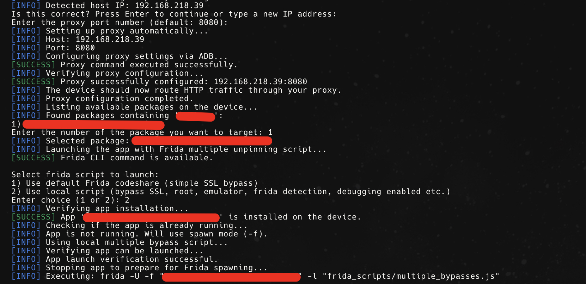

# ATPST

Android Testing Platform Setup Tool (ATPST) is a small script i wrote that semi-automated the prcoess of setting up Genymotion, frida, adb and bypassing Android Trustmanger when conducting security testing.

From my knowledge, Genymotion as of the day of this creation, requires a paid account to support `rooted` devices. Only `android  api 11`, are rooted. 

## Preliquisites
- MacOS. I initially built this for my macOS environment meaning some brew installs here and there. This can be easily modified to suite Linux systems as well. Feel free to edit.
- Genymotion is installed.
- Create the 'Custom Phone' with Android 12. - Purely because it is rooted.
- BurpSuite is installed and running - Again. This is not a fully automated tool. It just makes some work easier. Make sure burp in installed and running.
- Export burp CA der file to an accessible location. The tool will ask you for this.
- Im my environment, i had a package name i was working with all the time. I renamed this. Consider renaming `to-be-replaced-package-name` to something of your choice or remove the function. 

## What it did Originally
- Launche Custom Phone VM only
- Semi-automates portwigger cert installation. Will give instruction as you proceed.
- Download and install frida and frida-server based on the target cpu architecture.
- Start frida server.
- Installs openssl and adb.
- Instructs on the running local instance IP, user specifies port that burp is running on.
- Runs frida to bypass android `Trustmanager` to intercept SSL traffic.
- For my needs, i added a check to kill the VM i stop the script. Feel free to delete this fucntion if it doesnt suite your case.

## V2 New Improvements
- Option to select the VM of choice.
- Option to install user or system wide burp certificates (system wide is fully automated)
- Comparing frida and frider-server versions to prevent mismatch
- Added new option to automatically configure system proxy instead of manual entry in the wifi settings.
- Option to check if frida-server is already existing instead of wasting time downloading it with each run.
- added option to bypass root detection, emulator detection, frida detection, and debugging enabled.
- Improved root detection capabilities
- Check to detect running VMs and options to stop them (one or all) on start and after script execution.
- Some improved error handling and user experience.

## Installation
```sh
git clone https://github.com/i-sylar/ATPST/atpst.sh
cd ATPST
chmod +x atpst.sh
./atpst.sh
```
### Desired output





## Future implementation on v3
- Supply custom scripts.
- Download Genymotions VMs automatically.

 ## Challenges and debbuging
- I noticed things frida related break when they release an update for the frida script and takes some time to release the same for frida-server.. When this happens, manually hardcode  the previous version of frida in the script and it will download and use that.
